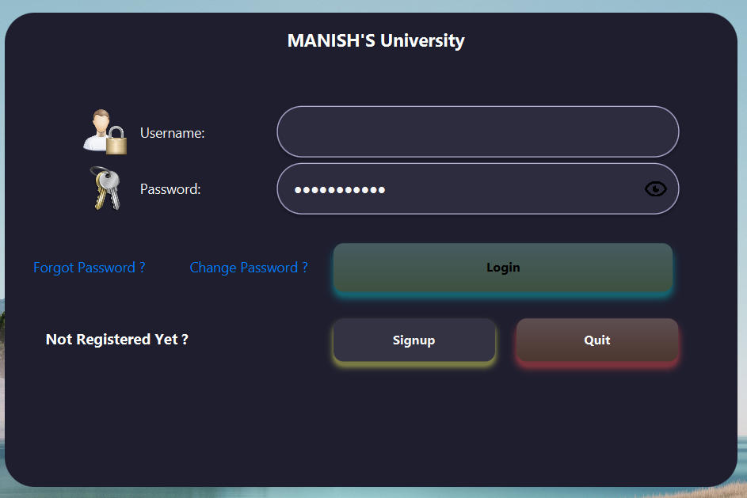
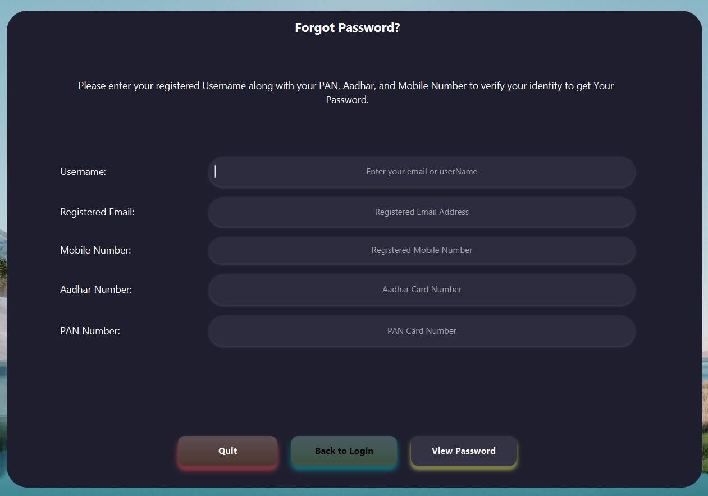
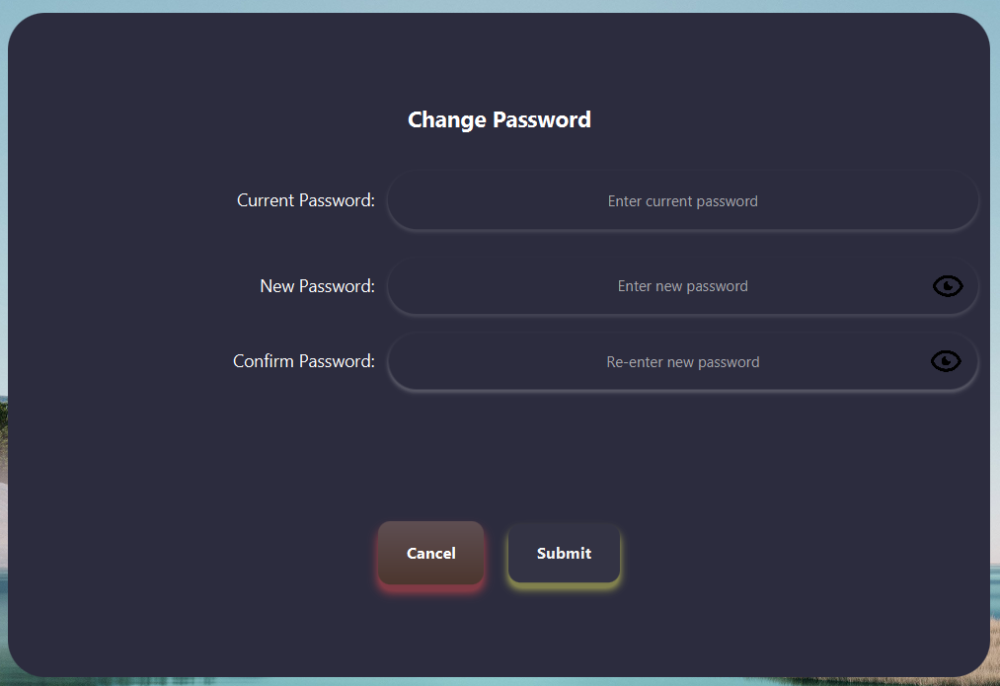
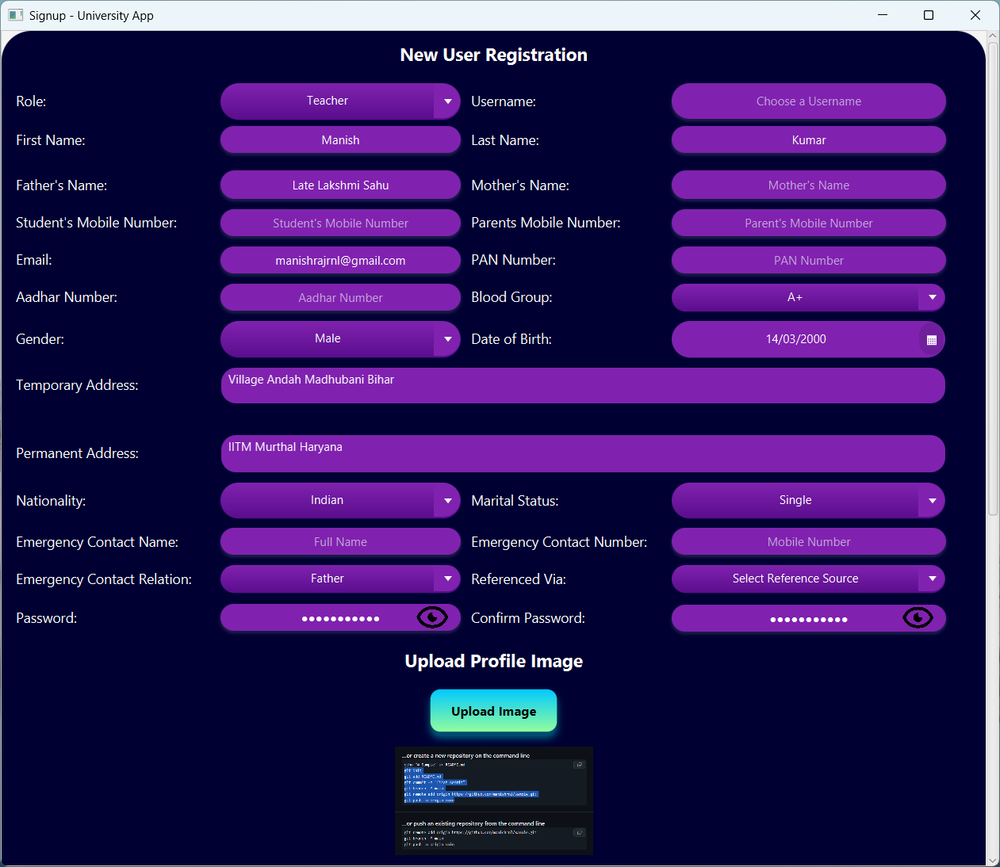
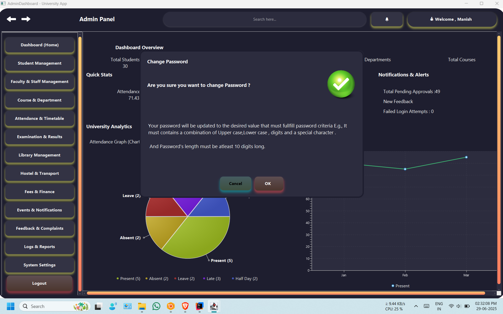

# 🏦 University Management System

[](https://www.java.com/)
[](https://www.mysql.com/)
[](https://owasp.org/www-project-top-ten/)
[](#)

## Please find the app and install it in your system . My app is inside folder named App , and application is named as   University_Management_System.exe
> A simple yet effective **University Management System** built using **JavaFX + MySQL**.  
> It simulates core ATM functionalities including **Login**, **Signup**, **Forget Password**, ,
> **Change Password** and **Role based Dashboard for admin,Teacher,Staff,etc** — designed for
> learning
> real-world
> banking
> concepts with secure backend logic.

---

## 🖼️ Preview


| Login Screen | Forget Password Screen | Change Password Screen | 
|--------------|------------------------|------------------------|
|  |  |  | 

| Signup Screen | Change Password |Admin Screen |
|---------------|-----------------|--------------|
|  | |  |


---
## 🚀 Features
### ✨ Rich & Interactive JavaFX GUI
- A modern, visually appealing user interface built with JavaFX.
- Custom-styled alerts, buttons, and UI components for a consistent look and feel.
- Engaging 3D animations and sound effects for a dynamic user experience.

### 🔐 Secure Authentication & Session Management
- Robust, role-based login system with database validation.
- Secure password change and "Forgot Password" functionality.
- Session management to keep user data safe and track login status.

### 👑 Comprehensive Admin Dashboard

- At-a-glance overview of key university metrics: student count, attendance, etc.
- Centralized management of all university modules.
- Analytics charts for enrollment trends, attendance, and departmental stats.

### 🎓 Full-Scale User Management

- Admins can manage detailed profiles for Students, Teachers, and Staff.
- Control user roles, statuses (Active, Inactive), and approval states.

### 📚 Academic & Campus Modules

- Student & Faculty Management: Onboard, view, and manage all users.
- Course & Department: Organize academic structures and course offerings.
- Attendance & Timetable: Track daily attendance and manage schedules.
- Examination & Results: Oversee exam processes and publish results.
- Library, Hostel & Transport: Manage essential campus services.
- Fees & Finance: Handle financial records and fee payments.
- Events, Feedback & Logs: Announce events, handle feedback, and maintain system logs.

### 🗃️ Robust MySQL Database Backend

- All university data is securely stored and managed in a relational MySQL database.
- Well-structured tables for users, authentication, attendance, and more, ensuring data
  integrity.

---

## 🔧 Technologies & Tools Used

| Technology      | Role & Description                                                  |
|-----------------|---------------------------------------------------------------------|
| **Java (JDK 21)** | Core application logic, backend functionality, and data handling. |
| **JavaFX** | Framework for building the modern, responsive, and interactive GUI. |
| **FXML** | Used to define the structure and layout of the user interface.      |
| **CSS** | Applied for all custom styling, theming, and component design.      |
| **MySQL** | Relational database for storing all university data (users, courses, attendance, etc.). |
| **JDBC** | Standard Java API for connecting the application to the MySQL database. |
| **Maven** | Manages project dependencies, plugins, and the overall build process.  |

---

## ⬇️ Download & Run

### 🔗 Clone the Repository

```bash
    git clone https://github.com/manishrnl/University_Management_System.git
    cd University_Management_System

```


---


## 🧭 Instructions

- Set up MySQL and import the provided SQL script.

- Configure your DB credentials inside the Java project.

- Add mysql-connector-java-8.0.28.jar inside folder 
  Library/mysql-connector-java-8.0.28.jar to the Project Structure to connect database.It is inside folder 
  Library

- Install Maven dependencies by running the following command in the terminal:
```bash
    mvn clean install
```

- Compile and run the main Java class (e.g., Main_Application.java located at src/main/java/org/example/university_management_system/Main_Application.java).

- Use test account credentials or register new users.

## 📌 Requirements
- ✅ Java 21+
- ✅ MySQL Database
- ✅ JDBC Driver
- ✅ IntelliJ IDEA or VS Code

## 📣 Future Enhancements
- 📧 Email/SMS notifications
- 📱 Android integration
- 🌐 Web Integration using Spring Boot and React.js
## 👨‍💻 Developed By
- **Manish Kumar**
- 📧 manishrajrnl1@gmail.com
- 🔗 GitHub Profile

## 📂 Project Structure
```bash
📁 University-Management-System/
├── 🚫 .gitignore
├── ⚙️ pom.xml
├── 📖 README.md
├── 📁 src/
│   └── 📁 main/
│       ├── 📁 java/
│       │   └── 📁 org/
│       │       └── 📁 example/
│       │           └── 📁 university_management_system/
│       │               ├── 📁 Admin/
│       │               │   └── ☕ AdminController.java
│       │               ├── 📁 Student/
│       │               │   └── ☕ StudentController.java
│       │               ├── 📁 Teacher/
│       │               │   └── ☕ TeacherController.java
│       │               ├── 📁 Staff/
│       │               │   └── ☕ StaffController.java
│       │               ├── 📁 Databases/
│       │               │   └── ☕ DatabaseConnection.java
│       │               ├── 📁 Java_StyleSheet/
│       │               │   └── ☕ Button3DEffect.java
│       │               ├── 📁 ToolsClasses/
│       │               │   ├── ☕ AlertManager.java
│       │               │   ├── ☕ CustomAlertController.java
│       │               │   ├── ☕ LoadFrame.java
│       │               │   ├── ☕ NavigationManager.java
│       │               │   └── ☕ SessionManager.java
│       │               ├── ☕ Login_Controller.java
│       │               └── ☕ Main_Application.java
│       └── 📁 resources/
│           ├── 📁 org/
│           │   └── 📁 example/
│           │       └── 📁 university_management_system/
│           │           ├── 📁 Admin/
│           │           │   ├── 🎨 AdminDashboard.fxml
│           │           │   └── 🎨 DashboardContent.fxml
│           │           ├── 📁 Student/
│           │           │   └── 🎨 StudentDashboard.fxml
│           │           ├── 📁 Teacher/
│           │           │   └── 🎨 TeacherDashboard.fxml
│           │           ├── 📁 Staff/
│           │           │   └── 🎨 StaffDashboard.fxml
│           │           ├── 📁 ToolsClasses/
│           │           │   └── 🎨 CustomAlert.fxml
│           │           ├── 🎨 ForgetPassword.fxml
│           │           └── 🎨 Login.fxml
│           ├── 📁 Images/
│           │   ├── 🖼️ Back.png
│           │   ├── 🖼️ Forward.png
│           │   └── ... (other images)
│           ├── 📁 Stylesheet/
│           │   ├── 🖌️ Dark_Theme.css
│           │   ├── 🖌️ Light_Theme.css
│           │   └── 🖌️ CustomAlert.css
│           └── 📁 sound/
│               └── 🎵 sound2.mp3
│               └── 🎵 error.mp3
└── ⚙️ University_Management_System.iml


```